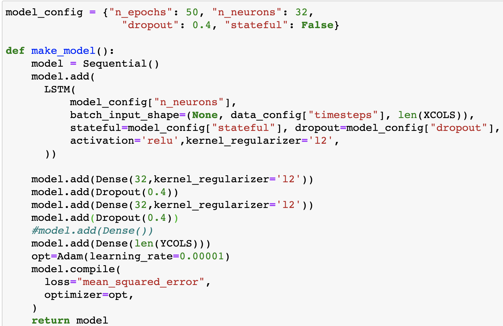
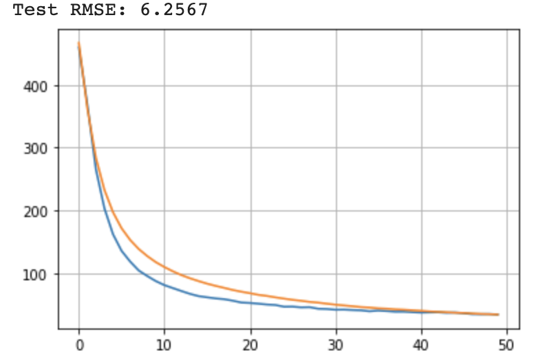

# MagNet: Model the Geomagnetic Field

- Team Members: [Ghanashyam Khanal](https://www.linkedin.com/in/ghanashyam-khanal/), [Nabin Malakar](https://www.linkedin.com/in/nabinkm/), [Shovit Bhari](https://www.linkedin.com/in/shovitraj/) and [Shree K Bhattrai](https://www.linkedin.com/in/shree-k-bhattarai-92625316/).

## Problem Description
The goal of this challenge is to develop models for forecasting Dst (Disturbance Storm-Time Index) that 1) push the boundary of predictive performance 2) under operationally viable constraints 3) using specified real-time solar-wind data feeds. 

## Data Preprocessing
- Feature Engineering:
    - Using our knowledge from Geo physics we dropped a few features which were very unlikely to affect the final prediction and picked only a few features for the LSTM model. 
- Data amputation:
    - Filled the missing data in `smoothed_ssn` using `forward fill` and `solar_wind` using `interpolation`
    - Converted the data to hourly resolution picking both mean as well as the standard deviation.

- Feature Scaling:
    - Used Standard Scaler to scale the data. This turned out to be pretty important for accuracy score.

## Model Building - LSTM
- Tried several things
    - play with batch_size
    - with or without the dropout (with dropout gave better RMSE)
    - Add batch normalization, it didn't improve the result
    - with or without activation function - tried Relu, sigmoid. Relu didn't improve the results 

Following is a screenshot of one of the model architecture.

## Loss plot and Accuracy
Following is the loss plot for train data (blue curve) and validation data (ornage curve) for one of our best models.

## Our Performance
Our final performance was inside top 50 (top 8%) submitted by Shree Bhattrai.

Here is a quick fact about total participants.

## Resources
- [Benchmark submission](https://www.drivendata.co/blog/model-geomagnetic-field-benchmark/)
- [DrivenData Git](https://github.com/drivendataorg/noaa-runtime)
- [DrivenData Website](https://www.drivendata.org/competitions/73/noaa-magnetic-forecasting/?fbclid=IwAR3lxCtsCLppvv9ooV36QJCWkP4_g8UT6MwX-TVllWSPQ97zlzEKQpSceHI)
- https://machinelearningmastery.com/how-to-develop-lstm-models-for-time-series-forecasting/ 
- [blog on multivariate time series forecasting](https://towardsdatascience.com/simple-multivariate-time-series-forecasting-7fa0e05579b2)
- https://github.com/Pythonyatra/MagNet
- [VAR Tutorial](https://www.machinelearningplus.com/time-series/vector-autoregression-examples-python/)
- [Nice tutorials on Time-Series Analysis](https://www.machinelearningplus.com/time-series/)
